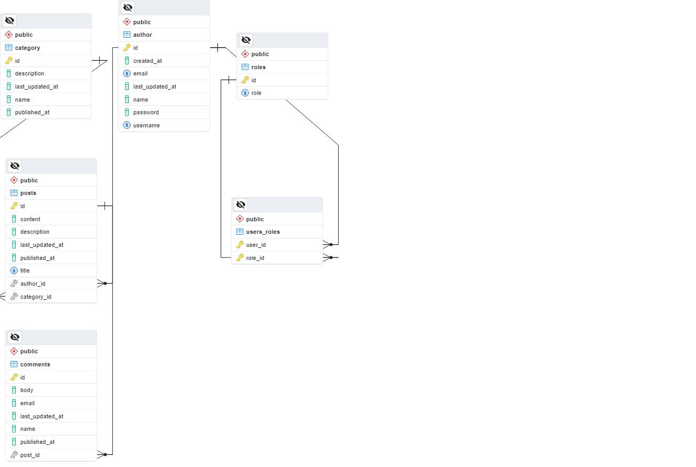

# Blogify
## Blogging Application


## **WEB SERVICE : REST A.P.I.**


## Features

- The API implements Spring Security and JSON Web Token (J.W.T) for authentication, validation, and authorization of users and administrators.
- The API includes functionality for pagination, sorting, and searching of data.
- The API implements custom exception handling for all exceptions and validations.
- The API utilizes custom request and response data transfer objects for all HTTP requests.
- The API's primary objective is to provide a streamlined and user-friendly blogging experience for users.
- Built on REST Architecture
- Consumable by clients that support HTTP Protocol
- Can be integrated with any application that supports REST API

## Tech Stack

- JAVA
- SPRING
- SPRINGBOOT
- HIBERNATE
- MAVEN
- J.D.B.C
- POSTGRESQL
- POSTMAN
- SWAGGER

## Dependencies

- JWT AUTHENTICATION
- SPRING SECURITY
- SPRING DATA JPA
- SPRING BOOT DEVTOOLS
- SPRING MVC
- HIBERNATE
- POSTGRESQL DRIVER
- VALIDATION
- LOMBOK


## User Functionalities

- **Authentication Management**

    - Endpoint for Sign Up
    - Endpoint for Sign In


- **Profile Management**

    - Endpoint for Updating User Information
    - Endpoint for Retrieving User Information
    - Endpoint for Deleting User Account


- **Post Management**

    - Endpoint for Creating Posts
    - Endpoint for Updating Posts
    - Endpoint for Retrieving Posts
    - Endpoint for Deleting Posts
    - Endpoint for Adding Comments to Posts
    - Endpoint for Retrieving Posts with Custom Pagination


- **Category Management**

    - Endpoint for Creating Categories
    - Endpoint for Updating Categories
    - Endpoint for Retrieving Categories
    - Endpoint for Deleting Categories


## Setting & Installation

Install the Spring Tools Suite or any Java IDE
```bash
https://spring.io/tools
```

Install PGAdmin4

```bash
https://www.pgadmin.org/download/
```

Clone the Project

```bash
git clone https://github.com/AStream26/Blogify.git
```

Open PGAdmin4
```bash
Create a New Database in SQL: "blog" 
```
Provide Login Details For Your Database

```bash
{
    "password": "*****",
    "username": "postgres"
}
```


## Run Locally


Go to the Project Directory

```bas
Open the Blog Application Folder with S.T.S or any Java IDE
```


Provide the following Environment variable to configure the Database and JWT
```bash
DB_PASSWORD=password
DB_USERNAME=postgres
JWT_SECRET=**secret**
PROFILE=dev
```

## ER Diagram




## Base Url
```bash
http://localhost:9999
```

## Base Url
```bash
http://localhost:9999/blog/swagger-ui.html
```
